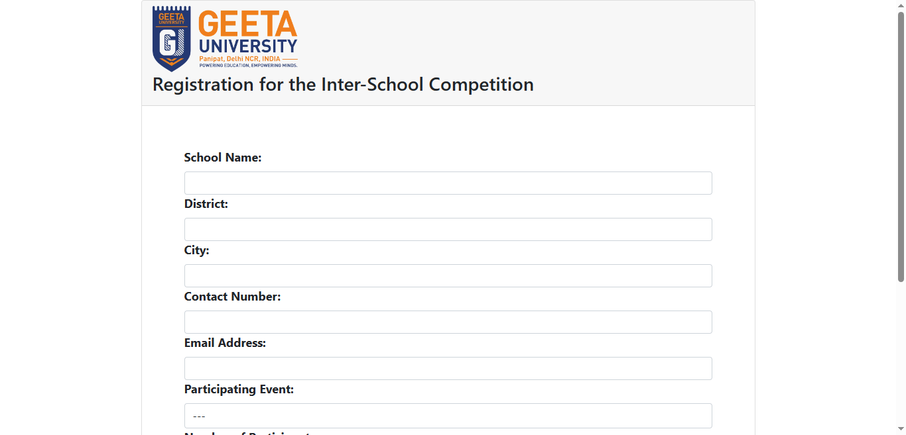
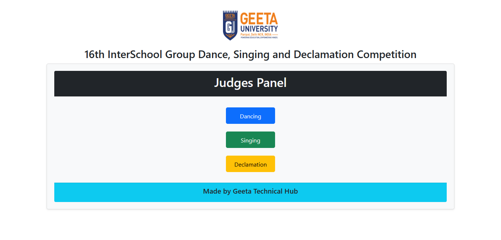
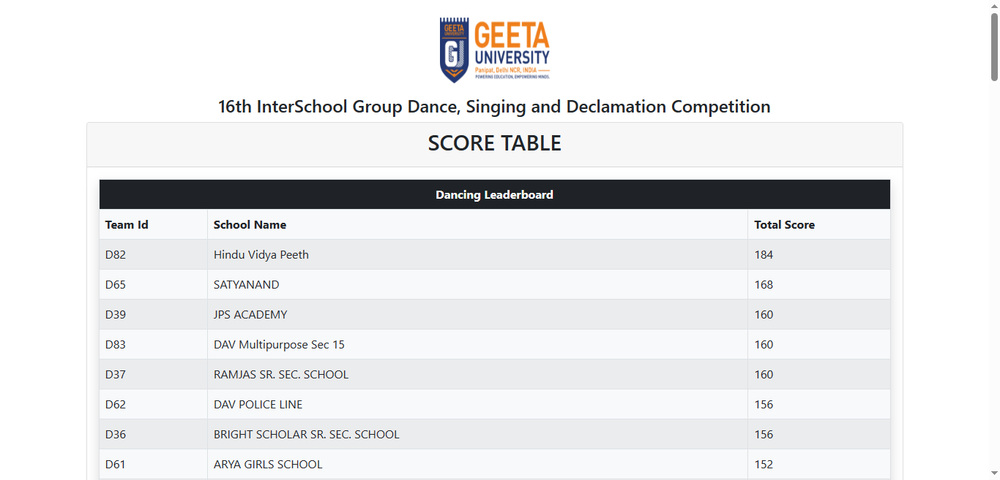

# Inter-School Competition Management System

[](LICENSE)

[](https://www.php.net/releases/7_4_3.php)
[](https://dev.mysql.com/doc/relnotes/mysql/8.0/en/news-8-0-19.html)

This project is a web-based system for managing an inter-school competition, covering events such as Group Dance, Singing, and Declamation.

> Make sure to ⭐ the Repo if you liked it -- It Helps!

## 📷 Screenshots





## Features

- **Event Registration:** Schools can register for the competition, providing details of participants and teachers.
- **Judges Panel:** Separate panels for Dancing, Singing, and Declamation events for judges to submit scores.
- **Leaderboards:** Dynamic leaderboards to display scores and rankings for each competition category.
- **Scoring System:** Judges can submit scores for different criteria, and the system calculates total scores.
- **Database Integration:** Utilizes a MySQL database for storing competition-related data.

## 📂 Files:

1. **[config.php](config.php):**

   - **Purpose:** Configuration file for database connection.
   - **Usage:** Include this file in other PHP files that need database access.

2. **[Database.php](Database.php):**

   - **Purpose:** PHP class for database operations (insert, select, etc.).
   - **Usage:** Used to interact with the MySQL database.

3. **[declamation.php](declamation.php):**

   - **Purpose:** Web page for entering scores in the Declamation competition.
   - **Usage:** Judges submit scores, and the data is stored in the database.

4. **[judges.php](judges.php):**

   - **Purpose:** Landing page for judges to access different competition panels.
   - **Usage:** Provides links to panels for Dancing, Singing, and Declamation events.

5. **[leaderboard.php](leaderboard.php):**

   - **Purpose:** Displays leaderboards for each competition category.
   - **Usage:** Retrieves data from the database and presents it in a tabular format.

6. **[register.php](register.php):**

   - **Purpose:** Allows schools to register for the competition, providing details of participants and teachers.
   - **Usage:** Captures school details, participant information, and teacher details, storing them in the database.

7. **[singing.php](singing.php):**

   - **Purpose:** Web page for entering scores in the Singing competition.
   - **Usage:** Judges submit scores, and the data is stored in the database.

8. **[assets/](assets/):**

   - **Purpose:** Directory for storing assets like images and stylesheets.

9. **[interschool2023.sql](interschool2023.sql):**

   - **Purpose:** SQL file for creating the database and tables.
   - **Usage:** Import this file into phpMyAdmin to create the database.

## 🛠 Installation Steps

1. Clone the repository:

   ```bash
   git clone https://github.com/your-username/inter-school-competition.git
   ```

2. Install [XAMPP](https://www.apachefriends.org/index.html).

3. Start the Apache and MySQL modules in XAMPP.

4. Open the `htdocs` folder in the XAMPP installation directory.

5. Copy the cloned repository folder into the `htdocs` folder.

6. Open the `phpMyAdmin` page in your browser.

7. Create a new database named `interschool2023`.

8. Import the [interschool2023.sql](interschool2023.sql) file into the database.

9. Open the [config.php](config.php) file and update the database credentials.

10. Open the [register.php](register.php) file in your browser.

11. Register a school and start using the system!

## 📝 License

This project is licensed under the MIT License. See the [LICENSE](LICENSE) file for details.

## 👨‍💻 Author

Created by:

- **[TheKaushikGoswami](https://github.com/thekaushikgoswami)**
- **[Humanshu Jaglan](https://github.com/humanshu001)**

<hr>

Made with ❤ in India


